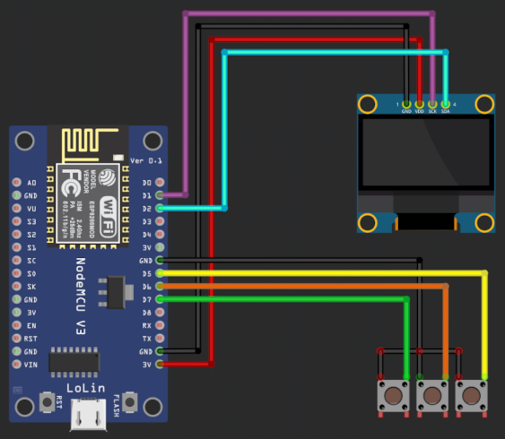
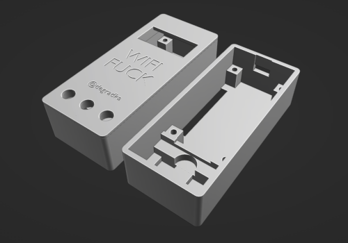
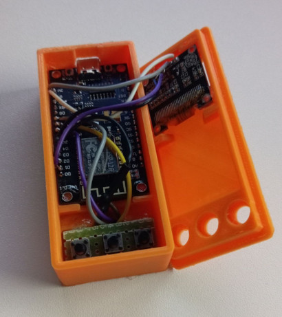
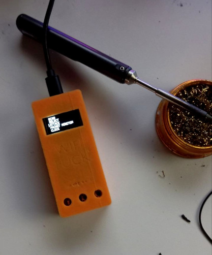

Hey there, fellow makers and tinkerers! Today, I want to share a fun project I’ve been working on — a portable WiFi deauthing device. This has been made countless times, but I still went with it.

<!--more-->
## The Idea

I got my hands on a NodeMCU with an ESP8266 chip and an OLED 128x64 pixels SSD1306 display. Using SpacehuhnTech's deauther firmware (which you can find [here](https://github.com/SpacehuhnTech/esp8266_deauther)), I decided to build a quick prototype. But you know how it is with prototypes—wires everywhere, things disconnecting at the worst possible times. I needed something more portable and reliable.

## Building the Prototype

First things first, I flashed the deauther firmware onto the ESP8266. It’s a straightforward process, but if you’re new to this, follow the instructions on [Deauther website](https://deauther.com/docs/category/diy-tutorial).

*Here's the initial and final wiring schematic.*

## Making It Portable

To solve the wire problem, I designed a 3D-printed case to house the components. This makes the device much more portable and protects the electronics from getting yanked apart.

*Case 3D model. It's compact and snugly fits the NodeMCU and the OLED display. The top part snaps into the main body.*

## Assembling the Device

After printing the case, I assembled the device. However, I didn’t have buttons yet, so I had to improvise. Enter the desoldering pump — a.k.a. my makeshift button pusher. It might look ridiculous, but it worked!

*Here’s a look at the insides. Everything fits nicely, and the display is securely glued in place.*

*And here’s the final product! It’s not perfect yet (still need to add proper buttons), but it’s functional, which sound like a win for me.*

## What’s Next?

The next step is to add real buttons to the device, so I don’t have to rely on my desoldering pump.

Also, it would be great to add a TP4056 charging module with a flat LiPo battery for portability. But honestly, I don't need it right now because I can still use a power bank to power the device.

Once the buttons are in place, this WiFi deauther will be a neat little tool for testing network security.

## Final Thoughts

So, there I was, wide awake with insomnia and dying from boredom. Yeah, I know, devices like this have been made a million times before and it's nothing new, but hey, I still had fun making it.

If you’re interested in building your own, definitely check out the [Deauther website](https://deauther.com) and give it a shot. Designing and 3D printing your own case can really take your projects to the next level.

Stay curious, keep tinkering, and don’t be afraid to improvise when you need to. Happy hacking!
