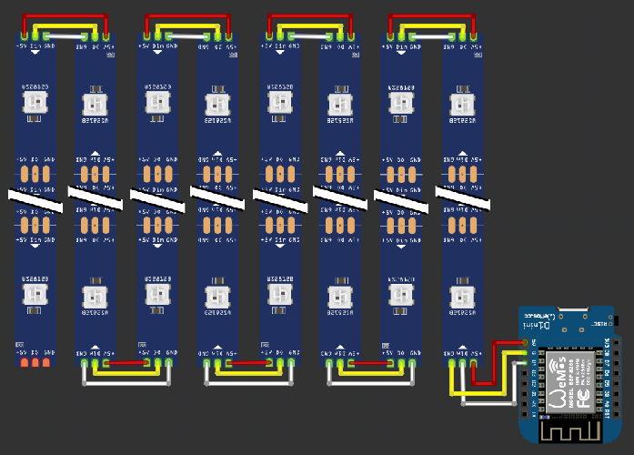

Hey there, fellow makers and tinkerers! Here's my journey of making this 16x16 led matrix come to life.

<!--more-->
## The inspiration

So, picture this: I've got this little Wemos D1 Mini just laying on my desk, collecting dust and not doing much else. I'm racking my brain, trying to figure out what the heck to do with it. But inspiration just ain't hitting me.

Then, one day, I'm messing around with this music visualizer thingy, right? And it hits me like a ton of bricks: what if I could turn my whole wall into this epic LED light show? Sounds dope, huh?

But hold up, I check out the prices for those fancy LED strips online, and let me tell you, they ain't cheap. So, I dial it back a bit and think, "Hey, why not start with just one panel?"

And that's how this project came to be. Not some big, elaborate plan or anything. Just a dude with dedication and a DIY spirit.

## Gathering materials

Now, when it came to gathering all the stuff I needed for this project, I didn't exactly have a shopping spree budget, if you know what I mean. I had to be real careful with where I put my hard-earned cash.

So, first up, I bought 5 meters of WS2812B LED strips, found some 6mm thick plywood I had lying around and the Wemos D1 Mini was already there. And last but not least, I needed something to cover all those LEDs. So I went into Blender and designed the 8x8 part for that, so I need 4 of them. 28 hours total print time ffs.

With everything in hand, it was time to roll up my sleeves and get to work. And let me tell you, seeing all those components laid out before me got me even more pumped to bring this porject to life.

## Building the Matrix

The wiring was a real head-scratcher at first, let me tell you. I must've spent hours tinkering and tweaking to get everything just right. But hey, perseverance pays off, right? Once I had all the strips lined up and the wires in place, it was onto the 3D printed parts. Now, those little guys gave me a bit of trouble. See, I printed them in this bright orange PLA material, and wouldn't you know it, the light ended up with this weird orange tint. Not exactly what I was going for. So, I busted out some black paint, gave those parts a quick makeover, and voila - problem solved!

Now, let's talk diffusers. I had this genius plan to use white fabric, but of course, when I searched my apartment, there were none. No biggie, though. I grabbed some paper tape instead and crossed my fingers. Turns out, it did the trick just fine. Doesn't look fancy in daylight, but just right at night.

With everything physically set up, I slapped on the custom wall mount I designed, hung the whole shebang on my wall, and got to work connecting the ESP8266 to both the matrix and my PC. And let me tell you, programming that bad boy was a whole adventure in itself.

*The wiring schematic. Simplified to 8x2 matrix for better visual comprehension*

## Bringing it to Life

After pulling an all-nighter fueled by more coffee than I care to admit, the moment of truth was upon me. With shaky hands, I click the upload button and held my breath, praying that all my hard work would pay off. And you know what? It did. Like, big time. As the LEDs flickered to life, bathing the room in a kaleidoscope of colors, I couldn't help but grin like a kid on Christmas morning.

## Refinement and Improvement

But hey, the story didn't stop there. Riding high on the wave of my little success, I was all fired up to kick things up a notch. So, I rolled up my sleeves and got down to business again, fine-tuning the project. I mean, who knew you could pack so much cool stuff into a humble LED matrix?

I started playing around with new features and tricks, testing out different effects and modes like a mad scientist in their lab. Picture this: paint mode, where you can tweak the colors of each LED to your heart's content. And don't even get me started on those preset effects - one click, and boom, you've got a whole light show right at your fingertips. It felt like the possibilities were endless, you know?

With each little tweak and addition, the LED matrix just kept getting cooler and cooler. It was like watching a kid grow up right before your eyes, except, you know, with LEDs instead of diapers. A true testament to what a little creativity and elbow grease can achieve.

## Conclusion

And there you have it, folks. My LED matrix, hanging proudly on my wall, casting its hypnotic sparkles effect. It's like having a little slice of magic right in my living room. Whether I'm admiring some pixel art or just enjoying the show, this thing never fails to impress.

You know what's cool? I went with a web-based controller instead of a physical one. It means I can switch up the effects whenever the mood strikes, even if I'm just chilling on the throne.

*The controller website I'm talking about.*

So, if you're curious about setting up your own LED matrix panel, head over to the [GitHub repo](https://github.com/degradka/led-matrix-magic) for all the details. Who knows, maybe you'll be wowing your friends with your own light show soon enough.
